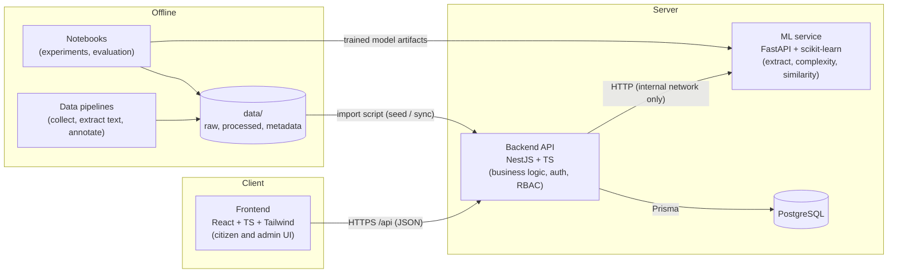

# 01: System Architecture

## Components



| Component | Owns | Does **not** do |
|---|---|---|
| **Frontend** | Rendering, routing, forms, client-side validation, language switching | Business rules, authorization decisions, direct DB/ML access |
| **Backend API** | Auth, RBAC, validation, verification workflow, versioning, audit logs, feedback, checklists, search orchestration | ML inference, text processing |
| **ML service** | Information extraction, complexity scoring, similarity search; stateless with a versioned model | Writing to the DB, auth, deciding what gets published |
| **PostgreSQL** | System of record for application data | n/a |
| **Pipelines / notebooks** | Reproducible data collection and research (Phases 2 and 6) | Serving live traffic |

## Backend modules (NestJS)

```text
backend/src/
├── common/          # error filter, validation pipe, pagination, guards, decorators, logging
├── prisma/          # PrismaService
├── auth/            # register, login, refresh, logout
├── users/           # profile, admin user management
├── categories/
├── services/        # service CRUD and public read model (verified content only)
├── content/         # requirements, steps, fees, processing times, locations (shared versioning logic)
├── sources/         # sources, snapshots, service-source links
├── verification/    # review queue, approve/reject, change records
├── feedback/
├── checklists/
├── analytics/       # admin dashboard aggregates
├── audit/           # audit log writer (used by other modules)
└── ml/              # ML service client (timeouts, fallbacks); added in Phase 7
```

Module boundaries are enforced by importing only from a module's exported providers. No cross-module repository access.

## Key flows

### Citizen reads a service
```text
GET /api/services/:slug
  → ServicesService.getPublic(slug)
  → query only VERIFIED, non-superseded content rows
  → attach sources (with last_checked_at) and "not stated" gaps
  → 200 JSON (km and en fields; client chooses)
```

### Admin approves extracted information
```mermaid
sequenceDiagram
    participant A as Admin UI
    participant API as Backend
    participant ML as ML service
    participant DB as PostgreSQL
    A->>API: POST /api/admin/extraction-jobs {snapshotId}
    API->>ML: POST /extract {text, language}
    ML-->>API: {requirements[], steps[], fee, ..., confidence}
    API->>DB: insert rows (status=PENDING, origin=EXTRACTED)
    A->>API: GET /api/admin/review
    API-->>A: pending items with evidence and source
    A->>API: POST /api/admin/review/requirement/:id/approve
    API->>DB: tx: row → VERIFIED; superseded row → OUTDATED;<br/>insert verification, change_record, audit_log
    API-->>A: 200
```

### ML unavailable
The `ml` module wraps every call with a 3 s timeout:
- **Search** falls back to PostgreSQL full-text and trigram search.
- **Complexity** returns the last stored prediction, or `null` with a "not available" flag.
- **Extraction** jobs are marked `FAILED` with the error, and admins can retry.

## Deployment (Phase 10)

```text
docker-compose
├── frontend    (nginx serving the built SPA; proxies /api → backend)
├── backend     (node, port 3000)
├── ml-service  (uvicorn, port 8000, not exposed publicly)
└── postgres    (volume-backed)
```

Configuration is supplied only through environment variables (`.env` locally, secrets in CI/CD). See [04_auth_and_roles.md](04_auth_and_roles.md#configuration).

## Cross-cutting concerns

| Concern | Approach |
|---|---|
| Validation | `class-validator` DTOs with a global `ValidationPipe` (`whitelist`, `forbidNonWhitelisted`, `transform`) |
| Errors | One global exception filter and one error shape (see [03_api_spec.md](03_api_spec.md#errors)); no stack traces in responses |
| Logging | Structured JSON logs (pino) with a request id; no passwords, tokens, or feedback comments in logs |
| Audit | `audit_logs` row for every admin write (approve, reject, edit, delete, role change) |
| Time | Stored as UTC `timestamptz`; formatted on the client |
| i18n | Content: `*_km` / `*_en` columns. UI strings: frontend message catalogs |
