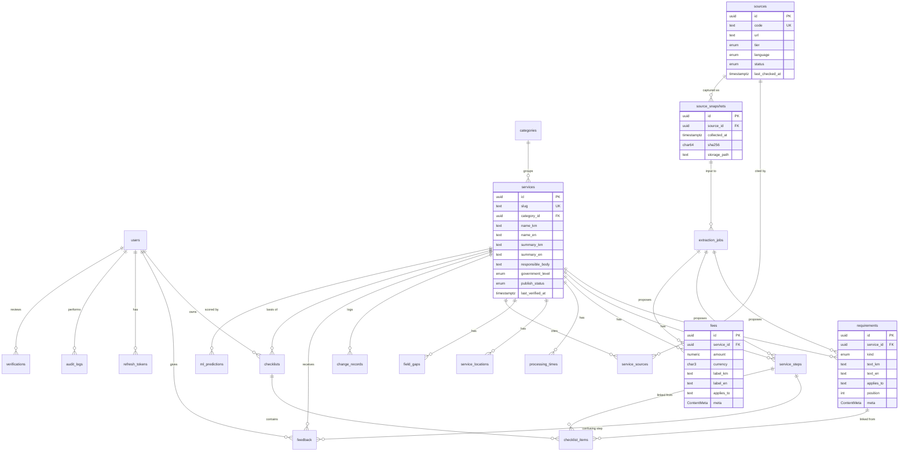

# 02: Data Model

## Verification and versioning model (the core idea)

Every piece of citizen-facing service information (a requirement, step, fee, processing time, or location) is a **content row** with its own lifecycle:

```text
                 approve                    a newer row is approved
   PENDING ─────────────────► VERIFIED ─────────────────────────────► OUTDATED
      │  ▲                        │
      │  └── UNDER_REVIEW         └── admin marks outdated ─────────► OUTDATED
      │ reject
      ▼
   REJECTED
```

- **Public API returns only `VERIFIED` rows.** There is no other path to publication (spec rule 11).
- **Edits never modify a verified row.** Editing creates a new `PENDING` row with `supersedes_id` pointing at the old one. When the new row is approved, the old row becomes `OUTDATED` in the same transaction. History is the chain of `supersedes_id` links, plus `change_records`.
- **Each row carries provenance:** `source_id`, `source_snapshot_id`, and verbatim `evidence`, exactly as in the Phase 2 annotations.
- **Origin** records how a row was created: `MANUAL` (admin typed it), `IMPORTED` (from `data/processed/annotations`), or `EXTRACTED` (ML job, with `confidence`).
- **Khmer first, enforced at publication:** Khmer text columns (`text_km`, `title_km`, `label_km`, `name_km`) may be empty while a row is `PENDING`, because imported facts are often English summaries of Khmer sources. A row **cannot become `VERIFIED` without Khmer text**, and a service cannot be `PUBLISHED` without a Khmer name. The approval code checks this, and database `CHECK` constraints back it up.
- **Gaps:** `field_gaps` records "the source was checked and does not state X". The UI can then show "Not stated by official sources" instead of nothing.

The shared lifecycle and provenance columns are called **`ContentMeta`** below.

## ERD



*(Columns are abbreviated in the diagram; full definitions follow.)*

## Tables

### `ContentMeta`: shared columns on every content table

| Column | Type | Notes |
|---|---|---|
| `status` | enum `ContentStatus` | `PENDING`, `UNDER_REVIEW`, `VERIFIED`, `REJECTED`, `OUTDATED` (spec §8) |
| `origin` | enum | `MANUAL`, `IMPORTED`, `EXTRACTED` |
| `supersedes_id` | uuid → same table, nullable | Row this one replaces |
| `source_id` | uuid → sources, nullable | **Required to approve** (enforced in the service layer) |
| `source_snapshot_id` | uuid → source_snapshots, nullable | |
| `evidence` | text, nullable | Verbatim quote |
| `extraction_job_id` | uuid → extraction_jobs, nullable | For `EXTRACTED` rows |
| `confidence` | real, nullable | 0–1, extraction only |
| `created_by` | uuid → users, nullable | |
| `verified_by` | uuid → users, nullable | Set on approve |
| `verified_at` | timestamptz, nullable | |
| `created_at`, `updated_at` | timestamptz | |

Indexes: `(service_id, status)` on every content table.

### Identity

**`users`:** `id uuid PK`, `email citext UNIQUE`, `password_hash text`, `display_name text`, `role enum(CITIZEN, ADMIN) default CITIZEN`, `preferred_language enum(km, en) default km`, `is_active bool`, `last_login_at`, `created_at`, `updated_at`.

> The spec lists a `Role` entity. With exactly two fixed roles, an enum column is simpler and type-safe. A `roles` table can replace it if a research role is added later (spec §4), without changing the guards' API.

**`refresh_tokens`:** `id`, `user_id → users ON DELETE CASCADE`, `token_hash char(64)` (SHA-256 of the token; the token itself is never stored), `family_id uuid` (rotation chain), `expires_at`, `revoked_at`, `created_at`. Index on `token_hash`.

### Catalogue

**`categories`:** `id`, `slug UNIQUE`, `name_km`, `name_en`, `position`.

**`services`:** `id`, `slug UNIQUE`, `category_id → categories`, `name_km` (required to publish; see below), `name_en`, `summary_km`, `summary_en`, `responsible_body_km`, `responsible_body_en`, `government_level enum(NATIONAL, PROVINCIAL, DISTRICT, COMMUNE)`, `publish_status enum(DRAFT, PUBLISHED, ARCHIVED)`, `last_verified_at` (maintained on approval), `search_vector tsvector` (generated), `created_at`, `updated_at`.
A service is visible to citizens when `publish_status = PUBLISHED`. Its content still shows only `VERIFIED` rows.

### Content (all include `ContentMeta`)

| Table | Specific columns |
|---|---|
| `requirements` | `service_id`, `kind enum(DOCUMENT, ELIGIBILITY, CONDITION)`, `text_km`, `text_en`, `applies_to`, `position` |
| `service_steps` | `service_id`, `position`, `title_km`, `title_en`, `detail_km`, `detail_en`, `applies_to` |
| `fees` | `service_id`, `amount numeric(14,2)`, `currency char(3) CHECK IN ('KHR','USD')`, `label_km`, `label_en`, `applies_to` |
| `processing_times` | `service_id`, `min_days int`, `max_days int`, `text_km`, `text_en`, `applies_to` (text is required because sources say things like "immediately" or "after inspection") |
| `service_locations` | `service_id`, `name_km`, `name_en`, `address_km`, `address_en`, `channel enum(IN_PERSON, ONLINE)`, `url`, `phone`, `hours_text`, `applies_to` |

**`field_gaps`:** `id`, `service_id`, `field enum(ELIGIBILITY, DOCUMENTS, STEPS, FEES, PROCESSING_TIME, LOCATIONS)`, `applies_to`, `source_id`, `checked_at`, `checked_by`. Unique on `(service_id, field, applies_to, source_id)`.

### Sources

**`sources`:** `id`, `code UNIQUE` (e.g. `S001`, matching `data/metadata/sources.csv`), `url`, `name`, `publisher`, `source_type enum(WEB_PAGE, PDF, LAW_RECORD)`, `tier enum(T1, T2, T3)`, `language enum(km, en)`, `status ContentStatus`, `last_checked_at`, `notes`, timestamps.
**Rule:** content can only be approved against a `T1` or `T2` source with `status = VERIFIED`.

**`source_snapshots`:** `id`, `source_id`, `collected_at`, `sha256 char(64)`, `content_type`, `bytes`, `storage_path` (path under `data/raw` or object storage). Unique `(source_id, sha256)`.

**`service_sources`:** `service_id`, `source_id`, `relevance enum(PRIMARY, SUPPORTING, LEGAL_BASIS, CONTEXT)`. PK `(service_id, source_id)`.

### Review and history

**`verifications`:** one row per review decision. `id`, `entity_type enum(REQUIREMENT, STEP, FEE, PROCESSING_TIME, LOCATION, SOURCE)`, `entity_id uuid`, `action enum(APPROVE, REJECT, MARK_OUTDATED, START_REVIEW)`, `reviewer_id → users`, `comment` (required for REJECT), `created_at`.

**`change_records`:** citizen-visible "what changed". `id`, `service_id`, `entity_type`, `entity_id`, `previous_entity_id` (the superseded row), `change_type enum(ADDED, CHANGED, REMOVED)`, `summary_km`, `summary_en`, `diff jsonb` (old and new field values), `created_at`. Written when an approval changes public content.

**`extraction_jobs`:** `id`, `source_snapshot_id`, `service_id` (target), `status enum(QUEUED, RUNNING, SUCCEEDED, FAILED)`, `model_version`, `requested_by`, `started_at`, `finished_at`, `error`, `items_proposed int`.

**`ml_predictions`:** `id`, `service_id`, `kind enum(COMPLEXITY)`, `model_version`, `score real`, `output jsonb` (the contributing factors, whose shape varies by model version, which justifies JSON), `created_at`. Latest per `(service_id, kind)` is shown.

> The spec's `DatasetRecord` entity is covered by the versioned files under `data/` (collection log, annotations), which are the training and evaluation datasets. Duplicating them in the application database adds no value in the MVP.

**`audit_logs`:** `id bigserial`, `actor_id → users`, `action text` (e.g. `content.approve`), `entity_type`, `entity_id`, `metadata jsonb`, `ip inet`, `user_agent`, `created_at`. Append-only: the app's database role has `INSERT`/`SELECT` only on this table.

### Citizen features

**`checklists`:** `id`, `user_id`, `service_id`, `created_at`, `completed_at`. Unique `(user_id, service_id)`; there is one active checklist per service.

**`checklist_items`:** `id`, `checklist_id ON DELETE CASCADE`, `requirement_id` or `step_id` (nullable FKs, exactly one set, `CHECK`), `label_km`, `label_en` (**copied at creation** so a checklist stays readable when content is later superseded), `position`, `is_done`, `done_at`.
When content linked to an open checklist is superseded, the API flags the item `content_changed: true` so the citizen can refresh it.

**`feedback`:** `id`, `service_id`, `user_id` (nullable; anonymous allowed), `kind enum(RATING, REPORT_UNCLEAR, REPORT_OUTDATED)`, `rating smallint 1–5`, `difficulty smallint 1–5`, `found_needed bool`, `outcome enum(COMPLETED, IN_PROGRESS, GAVE_UP, NOT_STARTED)`, `confusing_step_id → service_steps`, `comment text` (≤ 1000 characters), `status enum(OPEN, RESOLVED, DISMISSED)`, `created_at`.
**Privacy:** no names, phone numbers, ID numbers, or IP addresses are stored with feedback (spec §15). Rate limiting uses in-memory counters, not stored data.

## Seeding from Phase 2 data

`backend/prisma/seed.ts` will import:
- `data/metadata/services.csv` → `services` (`DRAFT`)
- `data/metadata/sources.csv` + `collection_log.csv` → `sources` (`PENDING`) + `source_snapshots`
- `data/processed/annotations/service_facts.csv` → content rows with `origin = IMPORTED`, `status = PENDING`, evidence preserved; `not_stated` → `field_gaps`

**Imports never set `VERIFIED`.** An admin approves imported data through the same review queue.
