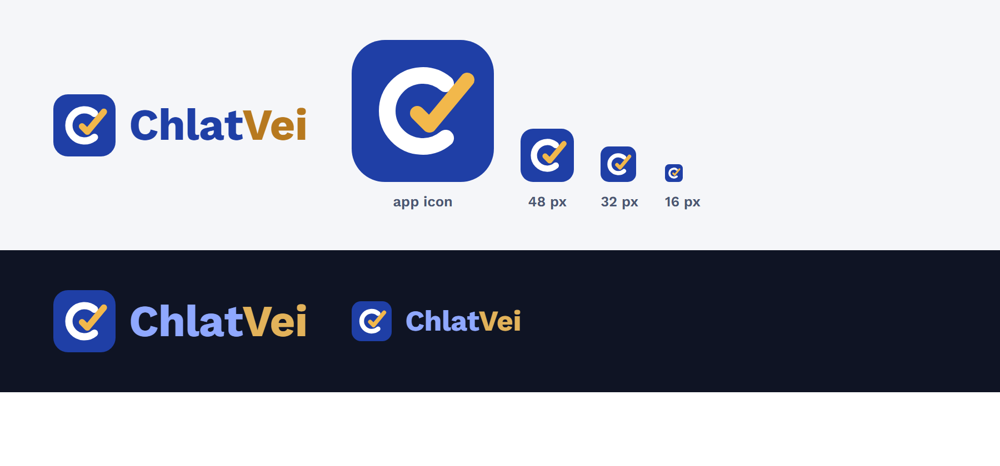

# Screen Designs

## Logo

The mark is a "C" for ChlatVei, opened by a gold check mark that stands for **verified guidance**, on a royal-blue rounded square. The source is [`frontend/public/logo-mark.svg`](../../frontend/public/logo-mark.svg); the app icons and favicon are generated from it. The name is always written in English.

> The app is now built. Screenshots of the **real** app, taken by the browser tests, are in [`app-screens/`](app-screens). The images below were the design reference.

Static images of the main screens. They are the visual reference for the Angular frontend (Phase 5, [ADR-006](../architecture/decisions/ADR-006-angular-pwa-frontend.md)).

| Image | Screen |
|---|---|
| [01-citizen-home-km](screens/01-citizen-home-km.png) | Home and search (Khmer) |
| [02-service-detail-km](screens/02-service-detail-km.png) | Service detail (Khmer) |
| [03-service-detail-en](screens/03-service-detail-en.png) | Service detail (English) |
| [04-checklist-km](screens/04-checklist-km.png) | Personal checklist with progress |
| [05-feedback-km](screens/05-feedback-km.png) | Feedback form |
| [06-admin-review-en](screens/06-admin-review-en.png) | Admin review queue: proposed content next to source evidence |
| [07-admin-dashboard-en](screens/07-admin-dashboard-en.png) | Admin dashboard |

What the designs show:
- **Mobile first.** Citizen screens are designed at phone width with bottom navigation. The admin uses a two-pane layout on wide screens.
- **Khmer first.** Khmer is the default language with an English switch. The name and logo are always "ChlatVei" in English. The Khmer UI copy still needs review by a native speaker.
- **"Not stated by official sources"** appears where a source is silent, here for processing time.
- **Approve stays disabled until Khmer text exists,** matching the backend rule and database constraint. **Reject needs a comment.**
- **Dashboard:** completeness uses real Phase 2 numbers. The confusing-steps chart uses **example** numbers, because no citizen feedback exists yet.

The content shown is the Phase 2 sample data (sources S001 and S003), labelled as not yet verified.
